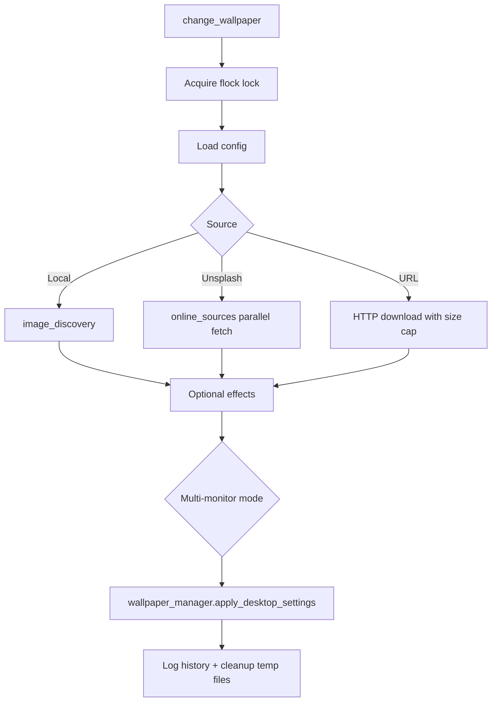

# WallShuffle Architecture

WallShuffle is a single-process GTK3 desktop application for Linux that changes wallpapers on a schedule or on demand. It runs as a background tray app with a configuration window, and exposes a headless CLI entry point for systemd timers and keyboard shortcuts.

## Runtime Modes

| Mode | Entry | Behavior |
|------|-------|----------|
| GUI | `wallshuffle` | Gtk.Application with tray icon and settings window |
| Headless | `wallshuffle --change` | One-shot wallpaper change, no GUI |

## Module Layout

```
wallshuffle/
├── __main__.py          # CLI args, logging, backend selection (X11 on Wayland)
├── app.py               # Gtk.Application, tray, single-instance IPC
├── core.py              # change_wallpaper() orchestration
├── wallpaper_manager.py # Desktop environment adapters (GNOME/KDE/XFCE)
├── config_manager.py    # Thread-safe singleton config I/O
├── online_sources.py    # Unsplash client, cache, circuit breaker
├── image_discovery.py   # Local folder scanning (uses image_index cache)
├── image_index.py       # mtime-based folder scan cache
├── sequential_state.py  # Persisted index for sequential rotation
├── effects.py           # Pillow-based image effects
├── system_integration.py# systemd timer and cron fallback
├── theme_engine/        # Theme resolution, validation, GTK CSS rendering
└── ui/                  # Settings window
    ├── panels.py        # GTK layout builders (mixin)
    ├── window.py        # Main window shell + init
    ├── dialogs.py       # ManageFoldersDialog
    └── handlers/        # Event handler mixins (polling, source, save, …)
```

## Wallpaper Change Pipeline



## Concurrency Model

- **Process lock:** `fcntl.flock` on `change_wallpaper.lock` serializes CLI, timer, and manual changes.
- **Config lock:** Shared/exclusive locks on `config.ini` for read-modify-write safety.
- **GUI threads:** Blocking work (network, systemd, folder counts) runs in daemon threads; UI updates via `GLib.idle_add`.
- **IPC:** Abstract Unix socket with length-prefixed messages (`WAKEUP`, `QUIT`, `STATUS`).

## Desktop Integration

| Environment | Mechanism |
|-------------|-----------|
| GNOME family | `gsettings` + optional multi-monitor stitch |
| KDE Plasma | `dbus-send` + `evaluateScript` |
| XFCE | `xfconf-query` per monitor |
| Scheduling | systemd user timer (primary), cron fallback |

## Configuration

Stored in `~/.config/wallshuffle/config.ini` (mode `0700`). Folder categories live in a `[FolderCategories]` section. Sequential rotation state is stored separately in `sequential_state.json`.

## Packaging

Distributed as AppImage, `.deb`, Flatpak manifest, and editable pip install. CI runs ruff, mypy, and pytest on Ubuntu with Python 3.10–3.12.